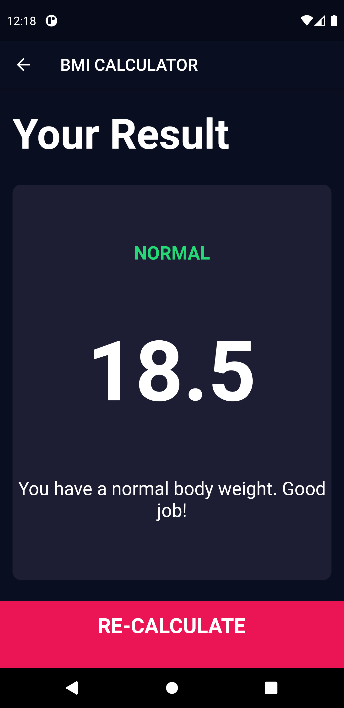
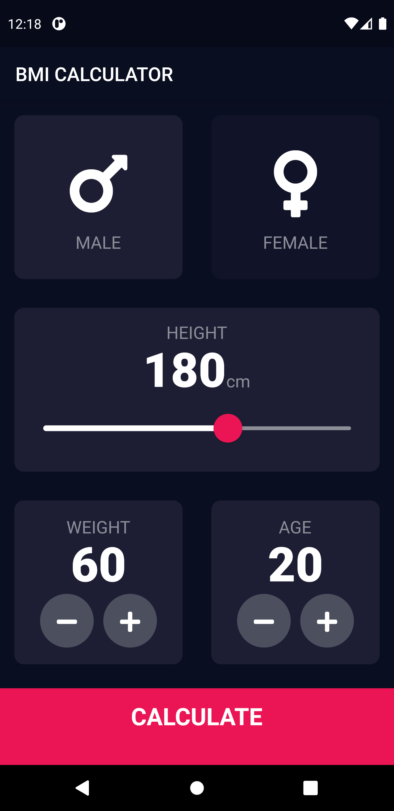

# Flutter BMI Calculator 🚀

Hey there, Flutter enthusiast! 👋 Ever wondered how to build a BMI (Body Mass Index) calculator using Flutter? Well, you're in luck! This repository holds a simple yet elegant BMI calculator, and I've documented each step so you can follow along and learn the ropes.




## Features

* Sleek UI: Because who said BMI calculators have to be boring?
* Responsive Design: Looks great on both mobile and tablet.
* User-Friendly: Easily input your height and weight, and get instant results!
* Interactive Tutorial: Want to learn how it's made? Dive into the code with our step-by-step guide.

## Getting Started

This project targets the latest stable version of Flutter (3.32.4 at the time of writing). To build and run the app:

1. Install Flutter 3.32.4 from [flutter.dev](https://flutter.dev/docs/get-started/install).
2. Fetch the packages:
   ```bash
   flutter pub get
   ```
3. Run the app on an emulator or connected device:
   ```bash
   flutter run
   ```

If you generated the project with an older Flutter version, make sure to upgrade by running `flutter upgrade` before fetching packages.
