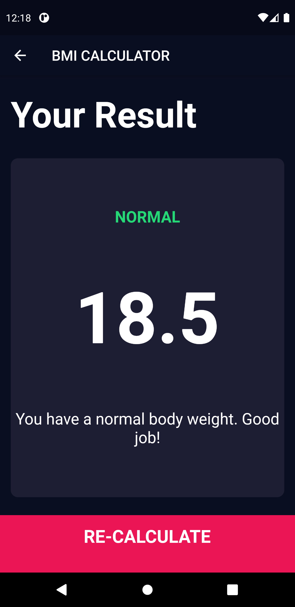
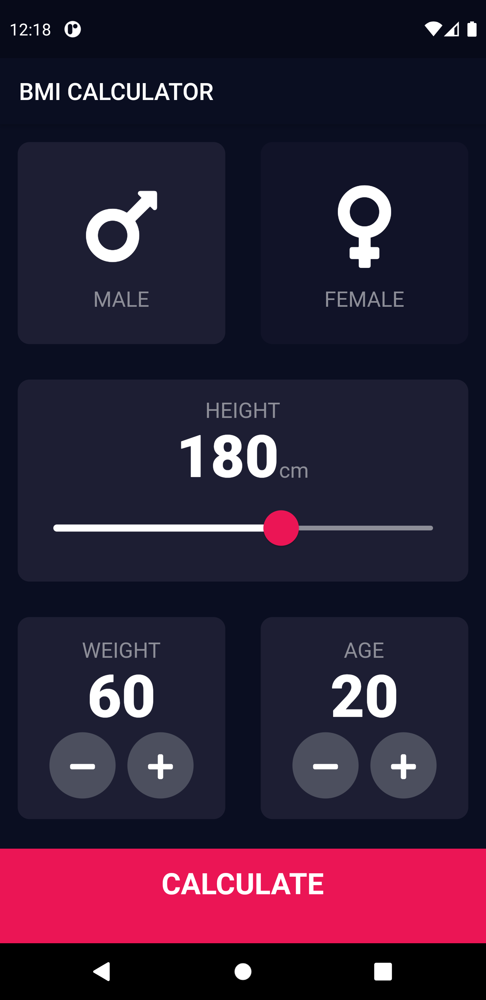

  

**Sagnik Bhattacharya**
Website: [sagnikbhattacharya.com](https://sagnikbhattacharya.com)

# Flutter BMI Calculator 🚀
Hey there, Flutter enthusiast! 👋 Ever wondered how to build a BMI (Body Mass Index) calculator using Flutter? Well, you're in luck! This repository holds a simple yet elegant BMI calculator, and I've documented each step so you can follow along and learn the ropes.

## Features
Sleek UI: Because who said BMI calculators have to be boring?
Responsive Design: Looks great on both mobile and tablet.
User-Friendly: Easily input your height and weight, and get instant results!
Interactive Tutorial: Want to learn how it's made? Dive into the code with our step-by-step guide.